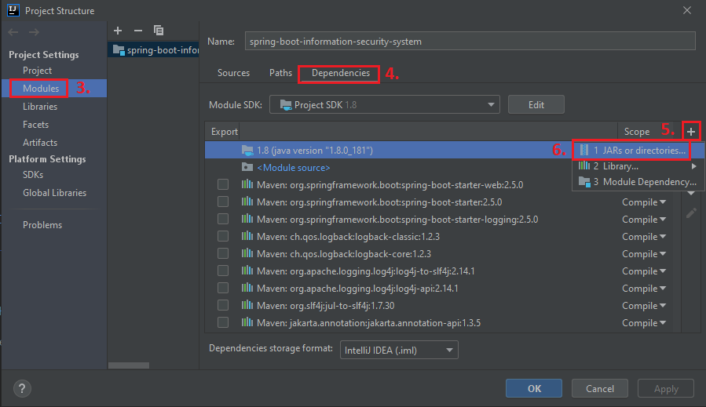
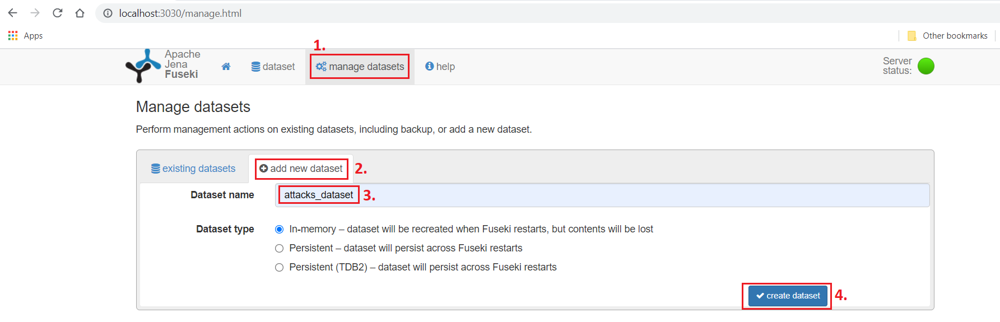

# KnowledgeEngineering

This project represents support system for information security department.

## Domain of Attacks - Communications
* **Mechanisms of Attacks:**
  * Collect and Analyze Information
  * Subvert Access Control
  * Engage in Deceptive Interactions

## Demo

#### Click on picture to view demo:

[](https://www.youtube.com/watch?v=ZpcfAWV7xCM)

## Build Maven Project

1. Install IntelliJ IDEA from [IntelliJ IDEA Official Page](https://www.jetbrains.com/idea/download/#section=windows).
2. Open IntelliJ IDEA  
3. Import project from ..\KnowledgeEngineering\spring-boot-information-security-system
4. Right click on pom.xml -> Add as Maven Project
5. Wait for all dependencies to be reloaded
6. Follow next steps to import lib <br/>



7. Go to ..\KnowledgeEngineering\apache-jena-fuseki-3.11.0<br/>
8. Run fuseki-server<br/>
9. Navigate to: http://localhost:3030<br/>
10. Follow next steps to configure database (Apache Jena Fuseki)



11. Right click on SpringBootInformationSecuritySystemApplication.java -> Run<br/>
* NOTE: This project requires SDK 1.8

## Build React Project 

1. Install NodeJs from [NodeJs Official Page](https://nodejs.org/en).
2. Open Terminal
3. Go to file project ..\KnowledgeEngineering\react-information-security-system
4. Run in terminal: ```npm install```
5. Then: ```npm start```
6. Navigate to: [http://localhost:3000/](http://localhost:3000/)

## Team 9 

| Student  | Name  | Surname |
| :---: | :---:  | :---:  | 
| 1  | Stefan | Savic  | 
| 2  | Aleksa | Ivanic  |
| 3  | Stefan | Beljic  |
| 4  | Matija | Mijalkovic  |
